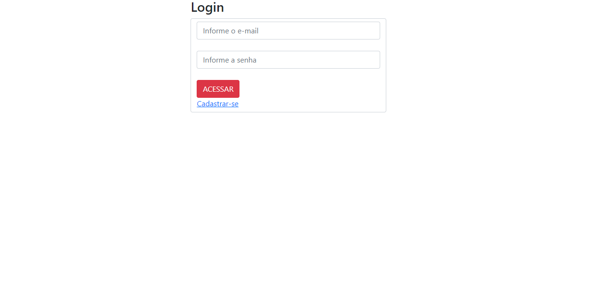
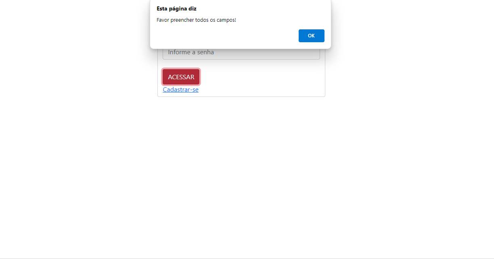

# LOGIN CAD

## LOGIN 
### OBJETIVO DO PROJETO
* Este projeto foi desenvolvido para permitir que os usuários realizem o login em um sistema.

* O usuário devera adicionar os campos corretamente. 
* O sistema (código) vai verificar os campos, caso esteja algo de forma incorreta ou não preechido um aleta vai aparecer e informar o usuário.
* Assim que estiver tudo certo o usuário sera direcionado para a página de cadastro, onde podera adicionar nomes de membros podendo edita-los e excluir .

